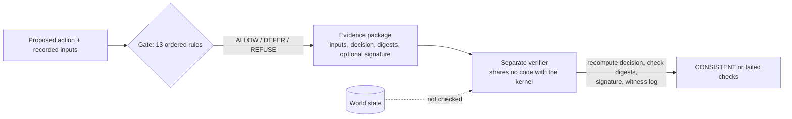

# Sovereign Veritas

<!-- 30s-demo -->
> **Status labels used below.** **PROTOTYPE:** runs, is tested, and is not hardened for production.
> **RESEARCH HYPOTHESIS:** stated, not yet shown. **NOT PRODUCTION-READY:** nothing in this repository is.

**Headline (measured):** a package whose authorization was revoked *and whose digests were all
resealed* still fails verification, because the verifier recomputes the Gate's decision from the
recorded inputs (`gate_replay`). A full verify takes about 125–143 ms on a container, Python
start-up included.

### 30-second demo — PROTOTYPE

```bash
git clone https://github.com/holland202/sovereign-veritas && cd sovereign-veritas
python tools/demo_30s.py          # standard library only; exit 0 only if every line is as expected
```

Output on x86_64, Python 3.11 (2026-09-30), pasted as printed:

```
    gate decision with a declared runtime state: ALLOW
ok  1 genuine package                            exit 0  VERDICT  CONSISTENT  freshness=NOT_PROVEN  authenticity=NOT_PROVEN  (133 ms)
    gate decision with no runtime state:          REFUSE ['runtime_state_unavailable']
ok  2 policy edited, not resealed                exit 1  VERDICT  1 check(s) failed  freshness=NOT_PROVEN  authenticity=NOT_PROVEN  failed: package_digest  (131 ms)
ok  3 authorization revoked, digests resealed    exit 1  VERDICT  1 check(s) failed  freshness=NOT_PROVEN  authenticity=NOT_PROVEN  failed: gate_replay  (137 ms)
    verifier wall time, genuine package, 5 runs (incl. Python start): min 125 ms, max 143 ms
DEMO PASS
```

**Try to break it:** [CHALLENGE.md](CHALLENGE.md). Breaks are credited by name in STATUS.md, and so are
independent reimplementations of the Gate that reproduce the contract digest.

### Negative results, up front

- **A fully consistent rewrite verifies.** If an attacker changes the inputs *and* the decision
  together and reseals the package, it passes. CONSISTENT means the package agrees with itself and
  with the Gate's rules. It does not mean the recorded world state is true.
- **A slow GPS spoof walked a simulated ArduCopter 61 m outside its fence while every check passed**
  (V11, [docs/VEHICLE_ACTION.md](docs/VEHICLE_ACTION.md)). The cross-check added since runs only at
  request time; a spoof started after the ALLOW is not seen (V14, a model, [docs/V14_CORRIDOR_RESULTS.md](docs/V14_CORRIDOR_RESULTS.md)).
- **A repeated `record_id` causes two real external effects and one ledger record** (XB-1,
  [docs/EXECUTION_BOUNDARY_RESULTS.md](docs/EXECUTION_BOUNDARY_RESULTS.md); reported in an AI-assisted
  private review by Davorin Popović, reproduced here). The ledger's duplicate check runs after `execute()`. A two-thread race does the
  same, and a write failure after a successful execute leaves an effect with no record. The sequential case is
  closed (PR #8: a known `record_id` is refused before execution). The race and the effect-without-record case
  are **open**; they are workflow/ledger limits, not Gate-contract issues, and XB-2 tests the candidate mechanisms. A
  write-ahead execution journal removes both in a prototype that `EvidenceWorkflow` does not use yet (EX-1,
  [docs/EX1_RESULTS.md](docs/EX1_RESULTS.md); its registered fuzz run was refuted and three journal defects were fixed).
- **The record reports the workflow's account of execution, not the effect** (EO-1,
  [docs/EO1_RESULTS.md](docs/EO1_RESULTS.md); question prompted by Terry Snyder's Elyria harness). With the guard
  broken so the executor runs on REFUSE/DEFER, the record, the package and `verify_package.py` still say "no
  execution recorded" and verify CONSISTENT. `SUCCEEDED` means the executor returned without raising: a no-op and a
  wrong action both record `SUCCEEDED`. The test suite does catch the broken guard (35 tests fail). **Open**; the
  candidate real fix is an executor-issued effect receipt the verifier checks. EX-1 builds such receipts in the same
  prototype; the verifier does not check them yet. A receipt proves who claimed the effect, not that it happened.
- **"PASS" and "authorized" are labels the caller writes.** An external review filed eleven breaks
  ([issue #4](https://github.com/holland202/sovereign-veritas/issues/4)). Two are fixed; the rest are
  assigned to `sv.gate/1`.
- **The Gate collapses some reasons for insufficient evidence** (EP-0, EP-1:
  [docs/EP1_RESULTS.md](docs/EP1_RESULTS.md)). "Verifier failed", "never verified" and "unreadable verifier
  output" give one REFUSE reason; "missing", "inaccessible", "never searched" and "out of scope" give one DEFER
  reason. All fail closed. Under a declared world model, only "never searched" changes an outcome (a caller that
  cannot see it retries instead of searching). A missing runtime value REFUSEs while a missing evidence item
  DEFERs. The `epistemic.py` vocabulary is not read by the Gate.
- **No second, independent implementation exists yet.** The kernel and the verifier agree on all 4690
  vectors, but both were written by one author. A Rust port written from CONTRACT.md alone by a separate Claude agent
  also conforms. It is the same vendor, so separate context, not independent judgment. It showed that the vectors leave
  vocabulary words and rounding ties unpinned ([docs/DIFFERENTIAL_RESULTS.md](docs/DIFFERENTIAL_RESULTS.md)).



### Why this is not just cryptographic logging, policy checks, or local inference

- **Not just logging.** A signed log proves that an entry was not changed. The verifier here also
  *recomputes the decision* from the recorded inputs, so a resealed entry with a changed input fails
  (case 3 above). A signature alone would not catch that, because the attacker resealed.
- **Not just a policy engine.** Cedar or OPA can make the ALLOW/DEFER/REFUSE decision; they are the
  closer comparison, and for the decision alone they are more mature. What is added here is a portable
  package that a separate program can re-check offline, plus 4690 conformance vectors that any second
  implementation can be scored against.
- **Not local inference.** No model runs in the Gate. A model's output is one input, and it is labelled
  as an observation, not proof.
- **Where it is no better than those tools:** it cannot tell a true input from a false one (see the
  negative results above).
<!-- /30s-demo -->


A fail-closed permission gate for AI actions. Before an action runs, the Gate decides
ALLOW, DEFER or REFUSE, and the decision can be written into an evidence package that a
separate verifier, sharing no code with this package, rebuilds and checks from the file alone.

Developed and run on a Galaxy S25 in Termux. Standard library only. The kernel makes no network
calls and has no telemetry; one optional red-team tool (below) calls NVIDIA's API when you run it.

## Try it — about 5 minutes, Python 3.10+

```bash
git clone https://github.com/holland202/sovereign-veritas
cd sovereign-veritas
python -m pip install -e ".[test]"
python -m pytest -q
python tools/make_package.py --thermal-status normal
# Copy the package path printed above, then run:
python tools/verify_package.py /path/to/the/package.json
```

Use `python3` if that is your interpreter. What you should see:

- **pytest:** all tests pass. On Windows the 8 anchored-ledger tests skip — that ledger needs
  POSIX file locking and refuses to write without it (tested on every platform).
- **make_package:** `decision ALLOW []` and a package path in your home directory.
- **verify_package:** 19 `PASS` lines and `VERDICT  CONSISTENT`.

Anything else is a finding. Please open an issue with your OS, Python version and the raw output.
Without `--thermal-status`, nothing vouches for the runtime state and the Gate REFUSEs: that is
the fail-closed default, not an error. `--thermal-status measured` derives the status from the
device's thermal zones instead of taking your word for it (below). Linux, macOS and Windows are tested in CI on every push
(GitHub-hosted runners); the author's own device is an Android phone.

Want to break it? Edit a package so the verifier still says CONSISTENT while it claims something
false. One way is already known and documented (a fully consistent rewrite, below). Anything
else is a real bug and will be credited.

Want to build it? [CONTRACT.md](CONTRACT.md) states the Gate's rules precisely enough to implement
in any language, and 4690 test vectors check the result: write a program that reads one case per
line and prints one decision per line, then run
`python tools/gate_contract.py --check-command <your program>`. A second implementation by someone
other than the author is the most useful thing this repository could get.

## Sign a package (optional — needs `ssh-keygen`; Termux: `pkg install openssh`)

```bash
python tools/sign_package.py keygen YOUR_NAME   # once; prints your allowed_signers line
# Save that line in a file, e.g. allowed_signers, and share it: it holds only the public key.
python tools/sign_package.py sign /path/to/the/package.json
python tools/verify_package.py /path/to/the/package.json --signature /path/to/the/package.json.sig \
    --allowed-signers allowed_signers --identity YOUR_NAME
```

`evidence/` holds three packages signed by this repository's author: the first S25 package
(witnessed) and the measured pair, ALLOW at rest and DEFER under load (not yet witnessed; see
`docs/EVIDENCE_PACKAGE.md`). They verify against the committed public key:
`--allowed-signers keys/allowed_signers --identity holland202`.

With a valid signature the verdict reads `authenticity=SIGNED:YOUR_NAME`. The private key stays in
`~/.ssh/sv_package_ed25519` and never goes in the repo. A signature proves who signed the exact
bytes, not when: freshness is still not proven.

## Prove a package is the newest (optional)

```bash
python tools/witness.py append /path/to/the/package.json   # adds its digest to witness/packages.log
git add witness/packages.log && git commit -m "witness package" && git push
```

GitHub's copy of that append-only log is the witness. A challenger pulls it themselves and runs
`python tools/verify_package.py /path/to/the/package.json --witness-log witness/packages.log`:
`LATEST_WITNESSED` passes; `STALE` (a newer package was witnessed) and `NOT_WITNESSED` fail. This
proves order, not time, and only among packages the author logged. It holds as long as nobody
rewrites `main`'s history. This repository's `main` is protected by the ruleset `protect-main`
(force pushes and deletions blocked on every branch, no bypass); a test force push was rejected by
GitHub on 2026-09-26 (`docs/EVIDENCE_PACKAGE.md`). Forks need their own protection.

## What a CONSISTENT package does not prove

Every package states these, and the verifier fails a package that drops one:

- **authenticity** — the package carries no signature; a fully consistent rewrite verifies.
  A detached signature checked with `--signature` closes this (see above); the statement inside
  the package still describes the package on its own
- **freshness** — an older valid package is indistinguishable from the newest. A witness log
  checked with `--witness-log` shows whether it is the newest the author made public (see above)
- **verifier identity** — declared by the caller, not bound to the verifier object that ran
- **resource state** — every package made now records where each runtime value came from, in
  evidence-ledger's vocabulary: `OPERATOR` (you supplied it), `DEFAULTED` (nobody did; a default
  was used), `ABSENT`, or `DERIVED`. With `--thermal-status measured`, `thermal_status` is derived
  from the zones read before the run under per-domain limits chosen from one S25 probe run (policy
  `s25-uncalibrated-v0`, not calibrated), and the verifier recomputes it. Unless you pass
  `--compute-budget` / `--power-status`, those two are `DEFAULTED` to healthy values, and the Gate
  counts a default as if it had been declared (docs/INTEGRATION.md, finding F1). The verifier
  refuses a tag that claims more than the package can support (`evidence_states`). A device
  without the S25's zone types reads `unknown` and REFUSEs

## What has been measured

| What | Result | Where |
|---|---|---|
| Test suite | 185 passed, code as at `5b64d8e` | S25, Python 3.14.6 (device) |
| Test suite, fresh clones | 157 passed @ `ed042e7` | container, Python 3.10, 3.11, 3.12, 3.13 |
| Gate: 4608-case decision lattice | identical decision digest | S25 3.14.6; container 3.10 and 3.12 |
| Gate: deliberate bugs planted | 19 of 19 caught | S25 and container |
| A real package made on the S25 | 16 of 16 checks, `CONSISTENT` | S25 |
| Damaged copies of that package | 0 of 17,157 truncations, 0 of 200 bit flips accepted | S25 (2026-09-25, and rerun 2026-10-04 with main's verifier); same result in a Linux container. The package is now published, unsigned: `evidence/device/sv_package_de9fee31b190.json` (`python tools/package_recovery_sim.py evidence/device/sv_package_de9fee31b190.json`). Until 2026-10-04 it was on the device only, which an outside reproduction ([docs/external](docs/external/amos-tipton_2026-10-04_reproduction_README.md)) pointed out. The tool calls `verify()` directly, so it does not exercise the hardened parser or the signature and witness path |
| Fully consistent rewrite | verifies — the documented limit | container |
| Single-field rewrites of a real S25 package, every digest recomputed | 405 of 796 verify (33 fields: recorded data nothing can recompute) | S25, unsigned |
| Same sweep, same S25 package, signed | 0 of 796 verify | S25 |
| Same sweep on the signed fixture package | 0 of 119 verify (44 without the signature) | container |
| Older package after a newer one is witnessed | `STALE`, exit 1 — even with a valid signature | container |
| Published package `evidence/sv_package_5bfc70dfcfa2.json`, all three layers, from a fresh clone of GitHub only | 20 of 20 checks: `CONSISTENT`, `SIGNED:holland202`, `LATEST_WITNESSED(1)` (true when run; the witness log has since grown to 6 entries, so this package now reports `STALE`. The current package, `sv_package_7548237bceca.json`, reports `LATEST_WITNESSED(6)`) | container x86_64, Python 3.11, OpenSSH 9.6 |
| CI on every push: Linux, macOS, Windows × Python 3.10 / 3.12 / 3.14 | 9 of 9 jobs pass; gate decision digest identical to the S25's in all 9 | GitHub Actions, run 36236747944 @ `197b0b0` |
| Thermal status derived from the zones, at rest | `normal`, ALLOW, 19 of 19 checks | S25 |
| Same, after 30 s all-core load | `hot` (cpu_core 103.8 °C), DEFER, 19 of 19 checks | S25 |
| The two measured packages, signed and published, checked from a fresh clone | 20 of 20 each, `SIGNED:holland202` | container |
| Single-field rewrites of the published DEFER package | 0 of 807 verify signed (408 unsigned) | container |
| Published evidence re-checked on every push | every package signed and consistent; every witness entry published | CI, 9 jobs |
| Verifier guards switched off one at a time | 27 of 27 make a test fail (2 needed new tests; full run 2026-10-03, ssh-keygen and pymavlink installed so no test skipped) | container, CI |
| Static scan for verification code with no fail path (vacuity_lint) | 0 findings in 66 files | container, CI |
| Gate contract: kernel and verifier against 4690 vectors | both conform, one digest | container, CI, S25 |
| Contract rules switched off one at a time | 22 of 23 fail a vector; the 23rd cannot be reached | container, CI |
| Reproduction by anyone else | **none yet** | — |

Details and raw output: [docs/GATE_CONSTRAINT.md](docs/GATE_CONSTRAINT.md),
[docs/EVIDENCE_PACKAGE.md](docs/EVIDENCE_PACKAGE.md), [docs/THERMAL_ZONES.md](docs/THERMAL_ZONES.md),
[STATUS.md](STATUS.md). Status of all of it: **self-tested** — one author and his AI tools
(Claude, ChatGPT) wrote the code, the verifier and the tests.

## Repository map

- `sovereign_veritas/` — the kernel: Gate, evidence records and ledgers, capabilities, runtime
  state, verifier registry, thermal evidence, evidence packages
- `tools/verify_package.py` — the independent verifier (imports nothing from the kernel)
- `tools/make_package.py` — produce one package on your machine
- `tools/gate_constraint.py` — checks the Gate's ALLOW set against a fail-closed spec
  (`--mutants` checks that the check itself can fail)
- `tools/package_recovery_sim.py` — feeds the verifier torn and corrupted copies of a package
- `tools/field_sweep.py` — lists every field an attacker can rewrite undetected (optionally with a signature)
- `tools/sign_package.py` — ed25519 signing via `ssh-keygen -Y`; the verifier checks with `--signature`
- `tools/witness.py` — appends a package to the freshness witness log; the verifier checks with `--witness-log`
- `sovereign_veritas/thermal_policy.py` — derives `thermal_status` from zones under a named policy
- `sovereign_veritas/evidence_states.py` — where each runtime value came from; no implicit promotion
- `tools/model_action.py` — a local model (llama-server) proposes an action; the Gate decides; the
  package lets anyone re-check the model's answer (docs/MODEL_ACTION.md)
- `tools/vehicle_action.py` — the Gate decides whether a flight command may be sent to a MAVLink
  autopilot (geofence, ceiling, navigation health, battery); tested against ArduCopter in simulation
  only, not on hardware; a slow GPS spoof walked it 61 m outside its fence while every check passed
  (V11); an optional cross-check against an independent position refuses that spoof in simulation
  (V12, with a stand-in source, not a sensor), so it is still not for GNSS-contested use (docs/VEHICLE_ACTION.md)
- `tools/verifier_mutants.py` — switches off each verifier guard in turn; the tests must fail
- `CONTRACT.md`, `contract/gate_vectors.jsonl`, `tools/gate_contract.py` — the Gate's rules, its test
  vectors, and the checker for any implementation
- `tools/thermal_probe.py`, `tools/physical_durability.py` — device measurements (Android/Linux)
- `tools/nvidia_challenge.py` — optional, EXPLORATORY, **makes network calls**: an NVIDIA-hosted
  model tries to forge a package; the local verifier judges. Needs your own key in `~/.nvidia_api_key`
- `sv_real_inference_test.py` — exploratory; needs a local llama-server; not part of the tests

## Related repositories

This repository is the kernel. The author's other work stays in its own repositories; what this
one takes from them is named in `docs/INTEGRATION.md` with the commit it came from:

- [eace](https://github.com/holland202/eace) — the method behind `tools/verifier_mutants.py`
- [evidence-ledger](https://github.com/holland202/evidence-ledger) — the evidence-state vocabulary
- [vacuity_lint.py](https://github.com/holland202/vacuity_lint.py) — run in CI, pinned
- [veritas-companion](https://github.com/holland202/veritas-companion) — upstream proposal layer; its
  actions are verified here (`tools/companion_action.py`), and its C005 bridge calls this verifier

Nothing else is merged in. Each of those has its own status and tests.

## Core ideas

1. Models produce observations, not proof.
2. Verification is a separate state from prediction.
3. Actions require a declared capability and evidence sufficiency.
4. The runtime may defer or refuse when evidence is incomplete or the environment is unsafe.
5. Decisions are append-only evidence, not informal status messages.
6. The adversary generates challenges and counterevidence; it never authorizes.
7. Authorization changes are ledgered **before** the registry mutates.

## Architecture

See [ARCHITECTURE.md](ARCHITECTURE.md) and [ROADMAP.md](ROADMAP.md).

Adversarial epistemic contract:
[docs/ADVERSARIAL_EPISTEMIC_VERIFICATION.md](docs/ADVERSARIAL_EPISTEMIC_VERIFICATION.md)

## Authority boundary

```text
Adversary ----X----> Veritas Gate
```

```text
external authorization
        ↓
EvidenceRecord
        ↓
EvidenceSink / Ledger
        ↓
registry mutation
```

If custody fails, the registry does not change.

## License and credit

MIT. You may use, change, share and sell this, including commercially, on one condition: keep the
copyright notice (`Copyright (c) 2026 Chad Holland`) and the license text with every copy or
substantial portion. That is the credit the license requires.

If you use Sovereign Veritas in work you publish — a paper, a product, a post — please also cite
it. GitHub's **Cite this repository** button gives the format (from `CITATION.cff`).

If your system draws on this work, a suggested acknowledgment and the rules this project uses to assess
influence claims in both directions (SUPPORTED / NOT SUPPORTED / INDETERMINATE) are in
[docs/LINEAGE.md](docs/LINEAGE.md). The underlying principles (fail-closed, separation of authorization
from execution, independent verification) are established prior art; what this project can be credited for
is its formulation and implementation of them.
